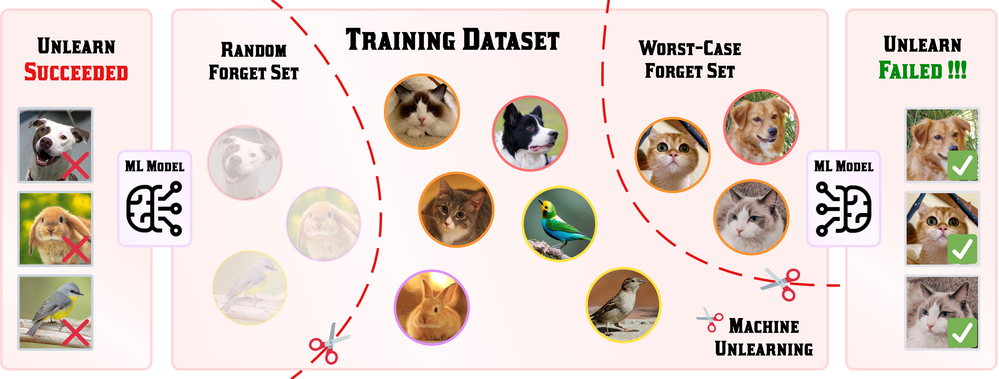

<div align='center'>

# Challenging Forgets: Unveiling the Worst-Case Forget Sets in Machine Unlearning

[](https://arxiv.org/abs/2403.07362)
[](LICENSE)

[](https://github.com/OPTML-Group/Unlearn-WorstCase)
[](https://github.com/OPTML-Group/Unlearn-WorstCase)
[](https://github.com/OPTML-Group/Unlearn-WorstCase)

<table align="center">
  <tr>
    <td align="center"> 
       
      <br>
      <em style="font-size: 18px;">  <strong style="font-size: 18px;">Figure 1:</strong> An overview of unlearning under worst-case forget set vs. random forget set.</em>
    </td>
  </tr>
</table>
</div>

Welcome to the official repository of paper *"Challenging Forgets: Unveiling the Worst-Case Forget Sets in Machine Unlearning"*.

## Abstract

The trustworthy machine learning (ML) community is increasingly recognizing the crucial need for models capable of selectively 'unlearning' data points after training. This leads to the problem of *machine unlearning* (MU), aiming to eliminate the influence of chosen data points on model performance, while still maintaining the model's utility post-unlearning. Despite various MU methods for data influence erasure, evaluations have largely focused on *random* data forgetting, ignoring the vital inquiry into which subset should be chosen to truly gauge the authenticity of unlearning performance. To tackle this issue, we introduce a new evaluative angle for MU from an adversarial viewpoint. We propose identifying the data subset that presents the most significant challenge for influence erasure, *i.e.*, pinpointing the *worst-case* forget set. Utilizing a bi-level optimization principle, we amplify unlearning challenges at the upper optimization level to emulate worst-case scenarios, while simultaneously engaging in standard training and unlearning at the lower level, achieving a balance between data influence erasure and model utility. Our proposal offers a worst-case evaluation of MU's resilience and effectiveness. Through extensive experiments across different datasets (including CIFAR-10, 100, CelebA, Tiny ImageNet, and ImageNet) and models (including both image classifiers and generative models), we expose critical pros and cons in existing (approximate) unlearning strategies. Our results illuminate the complex challenges of MU in practice, guiding the future development of more accurate and robust unlearning algorithms.

## Getting Started
* [The worst-case forget set on data-wise unlearning](data-wise)
* [The worst-case forget set on prompt-wise unlearning](prompt-wise)
* [The worst-case forget set on class-wise unlearning](class-wise)

## Contributors
* [Chongyu Fan](https://a-f1.github.io/)
* [Jiancheng Liu](https://ljcc0930.github.io/)

## Cite this work
```
@misc{fan2024challenging,
      title={Challenging Forgets: Unveiling the Worst-Case Forget Sets in Machine Unlearning}, 
      author={Chongyu Fan and Jiancheng Liu and Alfred Hero and Sijia Liu},
      year={2024},
      eprint={2403.07362},
      archivePrefix={arXiv},
      primaryClass={cs.LG}
}
```